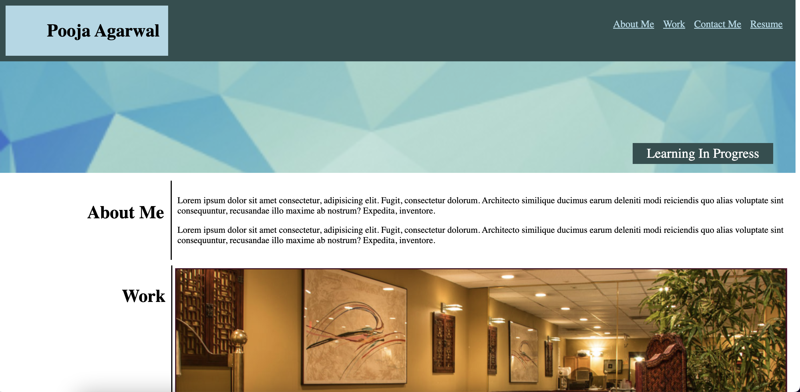
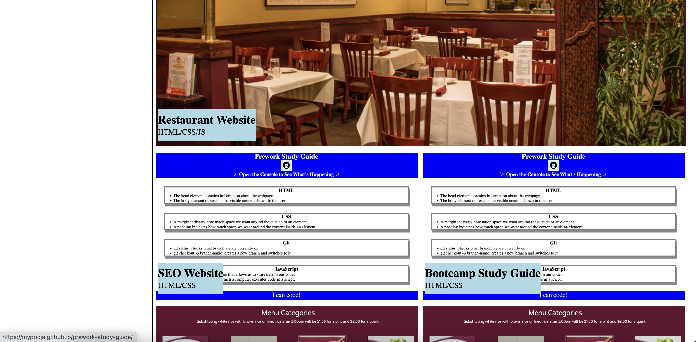

# Pooja portfolio website

## Description
This project is my programming portfolio that showcases my skills and provide details of my most significant programming projects.

## Installation

N/A

## Usage

This website has following sections -
1. Header with Nav
2. About Me
3. Work
4. Contact Me

### Navigation links
Clicking on Nav elements take the user to the respective section on the page.

Clicking on project images in the Work section takes the user to the deployed application.

Clicking on Nav links in the Contact Me section, takes the user to the respective contact.

### Accessibility
All the images in this project have accessibility tags and description.

### Layout
Website's layout changes between Large, Medium and Small screen sizes.

To capture the image of the complete webpage, its screenshots are divided into three sections - top, middle and bottom.

Link of deployed application - 
https://mypooja.github.io/pooja-portfolio-website

## Credits

None

## License

Please refer to the LICENSE in the repo.